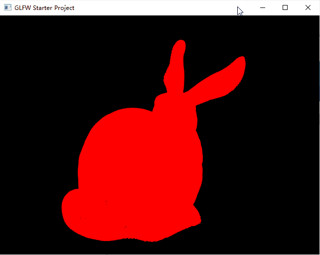
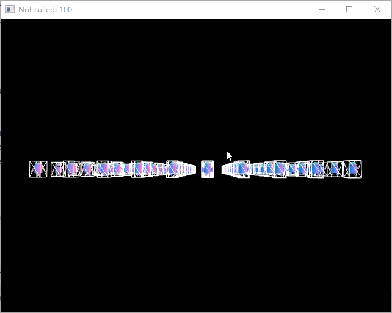

# Projects for Computer Graphics
I took UCSD CSE 167 in Fall 2019, descriptions can be found [here](http://ivl.calit2.net/wiki/index.php/ProjectsHomeworkCSE167F19).
Each project completed is tagged by Project1, Project2, Project3.

FOR ARCHIVE ONLY, DO NOT COPY!!!

## Compile & Run
Use CMake and compile with mingw-w64, and set working directory to the repo root when running executables.

## Project 1
- F1, F2, F3: change models
- (Shift+)P: make points smaller(larger)

## Project 2
- F1, F2, F3: change models, and phong components
- N: normal/phong
- 1: rotate/scale model
- 2: rotate/scale light
- 3: rotate/scale model & light
- Mouse: rotate
- Scroll: scale

## Project 3
- W, A, S, D, Q, E: move the camera
- Shift: move the camera in global/camera space
- C: start/stop culling
- Mouse: rotate
- Scroll: scale

## Project 4
- W, A, S, D, Q, E: move the camera
- Shift: move the camera in global/camera space
- N: normal/reflection map
- C: free/coaster camera
- P: start/stop sphere motion
- V: uniform speed/gravity simulation
- Click: change key points
- Mouse: rotate
- Scroll: scale

